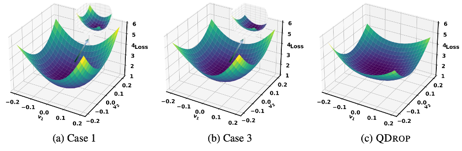

# QDrop
## Introduction
This repository contains the offical implementation for our paper **QDrop: Randomly Dropping Quantization for Extremely Low-bit Post-Training Quantization**

> In this work, we investigate how the activation quantization affects weight tuning. *QDrop* builds the relationship between activation quantization and flatness of quantized weights, and then proposes to randomly drop the activation quantization to achieve a flatter optimized weights. 



 - [x] 2023/07/11 Update codes of detection task on branch *qdrop_coco*

## File Organization

This branch *qdrop* contains the code of classificaion task on ImageNet dataset. Another branch *qdrop_coco* contains the code of detection task on MSCOCO dataset. For the code of MSCOCO, please see README in its branch.
```
QDrop/qdrop/
├── quantization/       [Quantization tools]
│   ├── fake_quant.py   [Implement quantize and dequantize functions]   
│   ├── observer.py     [Collect the information of distribution and calculate quantization clipping range]     
│   ├── state.py        [Set quantization states]

├── models/             [Definition of quantized models]

├── solver/ 
|   ├── main_imagenet.py [Run quantization on imagenet dataset]
|   ├── imagenet_util.py [Load imagenet dataset]
|   ├── recon.py         [Reconstruct models]
```
## Usage

Go into the exp/w2a4 directory. You can find config.yaml and run.sh for each architecture. Execute the run.sh for quantized model. Other bit settings only need to change the corresponding bit number in yaml file.

## Results

Results on low-bit activation in terms of accuracy on ImageNet.
| Methods |  Bits (W/A) | Res18 | Res50 | MNV2 | Reg600M | Reg3.2G | MNasx2 |
| ------- | ---- | ---- | ---- | ---- | ---- | ---- | ---- |
|   Full Prec. |   32/32 | 71.06 | 77.00 | 72.49 | 73.71 | 78.36 | 76.68   |
|QDrop| 4/4 | 69.13 | 75.12 | 67.83 | 70.95 | 76.46 | 73.04 |
|QDrop| 2/4 | 64.38 | 70.31 | 54.29 | 63.07 | 71.84| 63.28|
|QDrop| 3/3 | 65.68 | 71.28 | 54.38 | 64.65 | 71.69 | 64.05 |
|QDrop| 2/2 | 51.69 | 55.18 | 11.95 | 39.13 | 54.40 | 23.66 |


## Reference

If you find this repo useful for your research, please consider citing the paper:

    @article{wei2022qdrop,
    title={QDrop: Randomly Dropping Quantization for Extremely Low-bit Post-Training Quantization},
    author={Wei, Xiuying and Gong, Ruihao and Li, Yuhang and Liu, Xianglong and Yu, Fengwei},
    journal={arXiv preprint arXiv:2203.05740},
    year={2022}
    }
